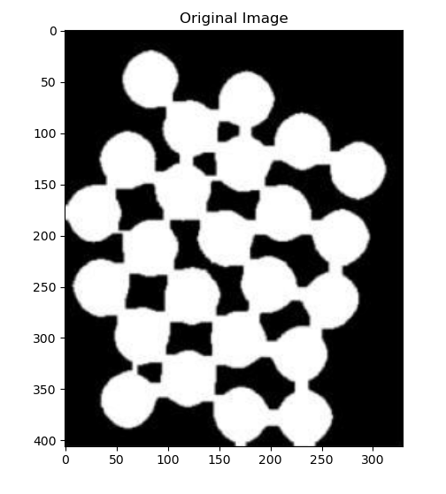
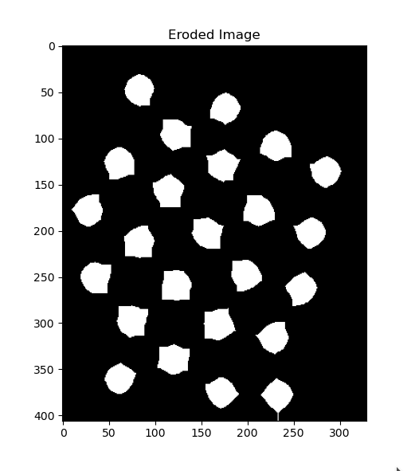
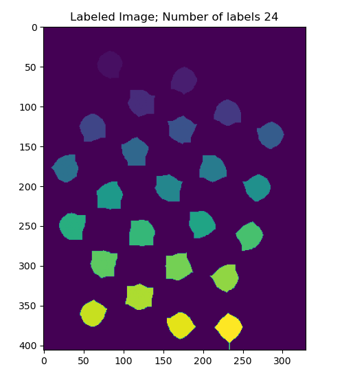

# Connected-Component-Labelling-Algorithm-For-Part-Labelling-From-Scratch
Objective: To implement connected component labeling algorithm from scratch to label different coins.

## Result:

1. Original Image

2. Image after erosion

3. Labelled parts

